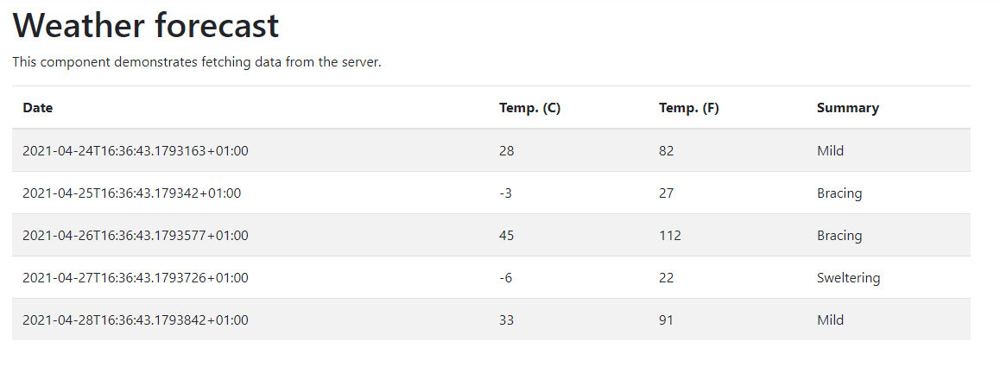

# README #

This is a sample application to be used as a base for this simple coding exercise. 

Please ensure you have created a **new branch** to make your changes in.

You can call the branch anything you like but please remember that this repository is **public**

### Task List ###

* **Password Validation**
  > Add additional Password Validation to prevent users from registering or changing their password to a password that has been exposed in a data breach.
* **Fetch Data Formatting**
  > Format the date in the Fetch Data grid to a human readable format
  
  > Update the Summary column to display friendly icons for each forecast summary  

### Password Validation ###

You should utilise the API from https://haveibeenpwned.com/Passwords to check for breached passwords.

Full API information can be found here https://haveibeenpwned.com/API/v3#PwnedPasswords An API Key is not required for searching passwords.

You should display a useful error message to the end-user

### Fetch Data Formatting ###

The grid in question is on the URL https://localhost:5001/fetch-data

